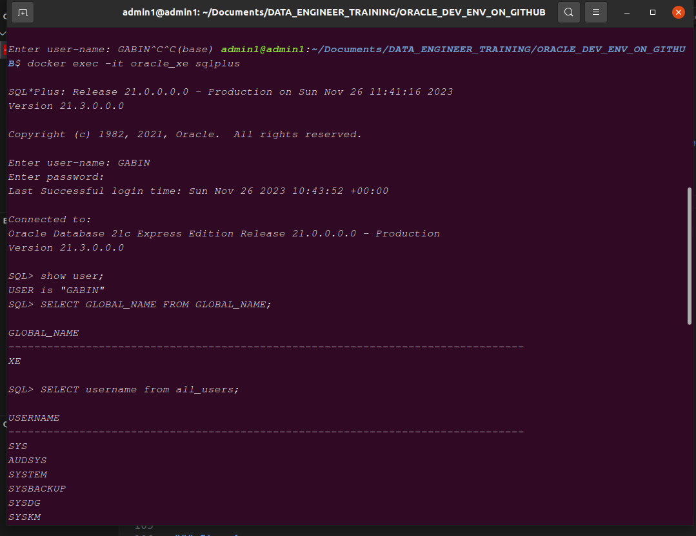

# WELCOME TO ORACLE DEVELOPMENT COMMUNITY

## Here is step by step process to install docker on ubuntu, pull oracle xe image , create oracle xe docker container, connect to it from ubuntu shell, install oracle sql developer and connect it oracle db from it

#############################           steps 1         ###############################

### Steps 1:  
### Install docker , docker compose on ubuntu:  
#### The command to setup Docker and docker compose actually installs four pieces of software on Ubuntu:

#### Docker CE
#### The Docker CE command line interface
#### containerd
#### The docker compose plugin

    -   sudo apt-get install docker-ce docker-ce-cli containerd.io docker-compose-plugin

#### Once you install Docker and docker compose, you can issue various commands in the terminal window. Popular commands to test the Docker setup on Ubuntu include:

    -   sudo docker --version
    -   docker compose version
    -   sudo docker run hello-world
    -   sudo docker images
    -   sudo docker ps -a

#### In order to avoid to always use sudo, you can add actual user connected to docker users group
#### If docker users group doesn't exist, create it with with command:
    -   sudo groupadd docker
#### After that add actual user to docker group by exec this command:
    -   sudo usermod -aG docker <username>
#### Now restart docker service on your ys in order to apply the new change:
    -   On systems using systemd (e.g., Ubuntu 16.04 and newer): sudo systemctl restart docker
    -   On systems using service (older Ubuntu versions, CentOS, etc.): sudo service docker restart
#### Verify Docker Group Membership:
    -   groups <username>

## NB : you need a docker hub account to pull docker images from it on windows but not required on linux

###########################     Steps 2        #############################

### Steps 2:
### Pull oracle XE docker image on your system

#### Go on docker hub website and enter this docker image name in search field in order to choose the tag that you want:  
    -   gvenzl/oracle-xe

####  Alternatively you can go on :   https://hub.docker.com/r/gvenzl/oracle-xe

#### After choosing your tag that you want for this image, you can pull it on your local sys by exec this command:
    -   docker pull gvenzl/oracle-xe:<your tag>   # replace <your tag> by your  tag name, if nothing is specified, it will choose latest by default 

#### Now can now wait for 1 min to 30 min based on the speed of your network

#######################              Step 3          ###########################

### Step 3 :
### Create your first oracle XE docker container, connect to it and run some sql commands

#### Create Oracle XE docker container:

    -   docker run -d -p 1521:1521 --name=<container name>   -e ORACLE_PASSWORD=<some password for SYSTEM user>   -e APP_USER=<some user name>   -e APP_USER_PASSWORD=<some password for user>   -v /path/to/your/prefered/directory:/opt/oracle/oradata   gvenzl/oracle-xe:<your tag or nothing if it is latest because it will choose latest by default>

#### Check if you container is created and started with this command:
    -   docker ps  # check your container name
    -   docker start <container name > #if you want to start it
    -   docker stop <container name> #if you want to stop it

#### Connect o your oracle database as SYSTEM user or as your customer user added when it is  running on docker container

    -   docker exec -it <container name> sqlplus 

#### It will prompt you your username and password , if it is that , provid it

#### After you are connecting successfully, you can now have sql shell that can help you to exec all commands that you can exec

#### For example :
    -   CREATE TABLE EMPLOYEE(id int not null, username varchar2(25));
    -   INSERT INTO EMPLOYEE VALUES (1,'ROBER');
    -   INSERT INTO EMPLOYEE VALUES (2,'Rose');
    -   SELECT * FROM EMPLOYEE;
    -   SHOW USER;  #show actual user
    -   SELECT GLOBAL_NAME FROM GLOBAL_NAME;  #show actual database
    -   SELECT username from all_users;   #Show all username

#### So you can execute all  commands that you can

##################      Step 4          ##################

### Step 4:
### Install oracle sql developer in order to connect to your oracle database from application desktop interface and execute all commands on it

#### Download the oracle sqldeveloper package from this website: https://www.oracle.com/database/sqldeveloper/technologies/download/

## NB You need to have account on https://www.oracle.com/ before download it

#### Follow the differents instructions in this youtube video to install successfully oracle sqldeveloper on sys after download it:  https://youtu.be/t1ZV4iypAvg?si=lS-psJ1YCvR0bK0r

# Now you are able to manage your oracle database on docker container and from oracle sqldeveloper desktop app

## Thank you so much for your reading!!!

